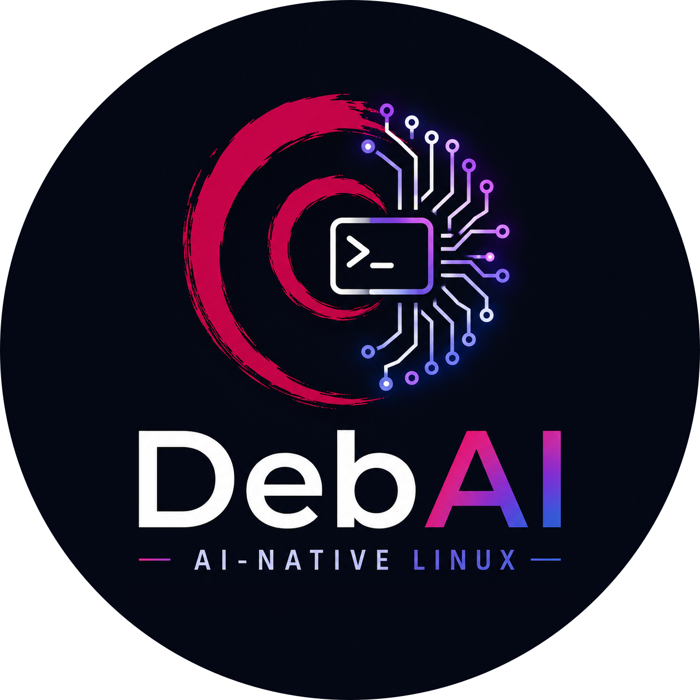
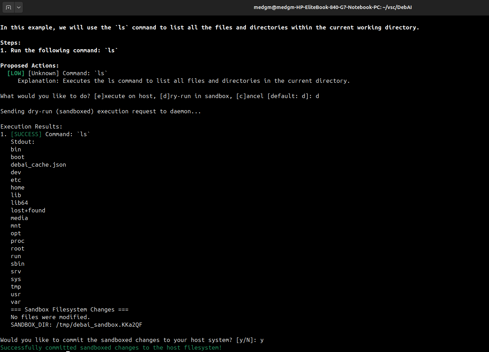
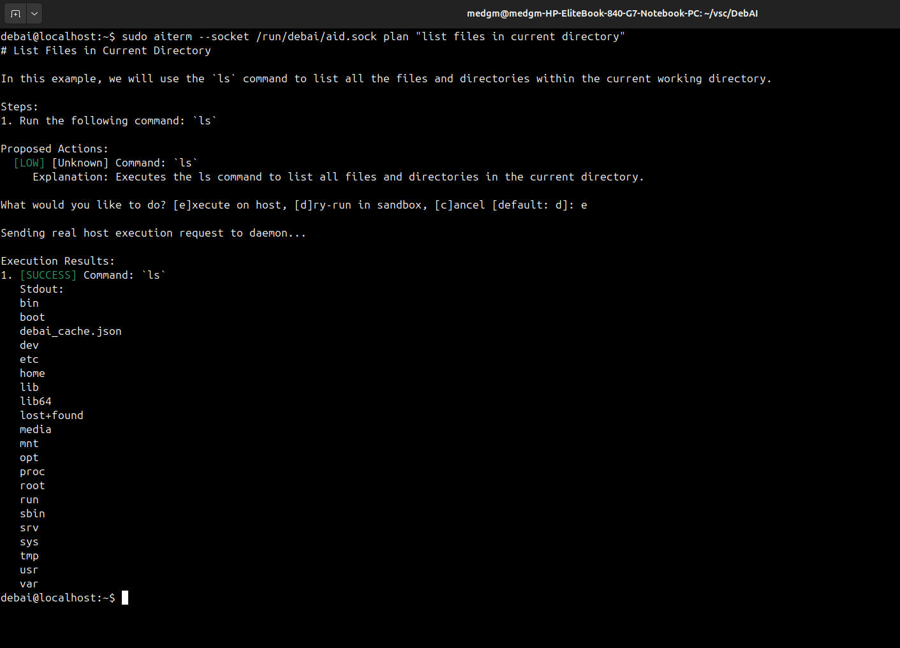

<p align="center">
  
</p>

<h1 align="center">DebAI</h1>

<p align="center">
  <strong>An AI-native Linux Distribution layer where Artificial Intelligence is treated as a first-class operating system service.</strong>
</p>

<p align="center">
  <a href="https://github.com/MedGm/DebAI/blob/main/LICENSE"></a>
  
  
  
</p>

---

## 📖 Introduction

**DebAI** integrates a local, lightweight SLM (Small Language Model) directly into the Debian operating system's systemd daemon layer. Instead of running command-line agents that execute risky queries directly on your shell, DebAI introduces a client-server architecture where natural language intent is analyzed, sandboxed, and authorized through a structured transaction pipeline.

## 🚀 Key Features

* **Local SLM Inference**: Integrates with a local Ollama instance running a lightweight model (`qwen2.5:1.5b`), requiring zero external API keys and keeping all system data local and private.
* **Transactional OverlayFS Sandboxing**: Supports isolated execution dry-runs (`d`) inside a real Linux mount namespace using OverlayFS. Users can preview file/directory additions or changes and choose to discard them or commit (`y`) them to the host OS.
* **Dynamic Safety Policy Layer**: Inspects planned actions using custom policies in `/etc/debai/policy.json` (such as matching forbidden commands, adjusting risk evaluations, and blocking high-risk operations from host execution).
* **Extensible Plugin Hooks**: A subprocess-based hook system executing external plugins for `pre_execute` (validation, safety sentinels) and `post_execute` (audits, telemetry logs).
* **Performance Query Cache**: A local query cache (`debai_cache.json`) that responds in `<150ms` for exact query hits while dynamically re-verifying security policies.
* **Dockerized Compilation & VM Delivery**: Built-in scripts to compile code inside a Debian Bookworm Docker container (preventing host GLIBC mismatches) and customizing a bootable QEMU VM cloud image.

---

## 📸 Console Demonstrations

### 1. Isolated Dry-run (Sandbox) & Commit
Dry-running a plan executes it inside an OverlayFS-merged directory namespace. It displays all filesystem modifications and lets the user merge changes back into the primary OS:

<p align="center">
  
</p>

### 2. Direct Host Execution
For low-risk, trusted, or verified operations, commands can be run directly on the host system:

<p align="center">
  
</p>

---

## 🛠️ Architecture

```
                 [ User Shell ]
                       │
             (Natural Language Query)
                       ▼
            [ Client CLI: aiterm ]
                       │
             (Unix Domain Socket)
                       ▼
          [ System Daemon: aid (Root) ]
           ├── 1. Query Cache (Check)
           ├── 2. Local SLM (Intent Planning)
           ├── 3. Policy Engine (Verify & Sanitize)
           ├── 4. Plugins (Pre-run Hook)
           ├── 5. Execution Runner ──► [ OverlayFS Sandbox ]
           └── 6. Plugins (Post-run Hook)
```

---

## ⚙️ How to Build & Install

### 1. Requirements
Ensure you have the following installed on your host system:
* Docker (used for compiling binaries with the target VM's GLIBC version)
* QEMU & `virt-customize` (`libguestfs-tools`)

### 2. Build the Debian Package
To generate the `.deb` installer with Bookworm-compatible binaries:
```bash
./scripts/build_deb.sh
```
This produces `target/debai.deb`.

### 3. Build & Customize the VM
To download a clean Debian 12 base image, apply system configurations, pre-install the DebAI package, and configure Ollama:
```bash
./scripts/build_vm.sh
```
This outputs `debai-debian-12.qcow2`.

### 4. Boot the VM in QEMU
```bash
./scripts/run_vm.sh
```
Login with the credentials:
* **Username**: `debai`
* **Password**: `debai`
* **Root Password**: `debai`

---

## 💻 CLI Usage (Inside VM)

Once logged in, standard users can invoke the CLI client:

```bash
# Explain a command
aiterm --socket /run/debai/aid.sock explain "tar -czvf backup.tar.gz /etc"

# Explore a directory
aiterm --socket /run/debai/aid.sock explore "/var/log"

# Ask a system query
aiterm --socket /run/debai/aid.sock query "who is logged in right now?"

# Generate and execute plans
aiterm --socket /run/debai/aid.sock plan "create a backup directory inside /root and copy debai logs there"
```

---

## 📄 License

This project is licensed under the [MIT License](LICENSE).
